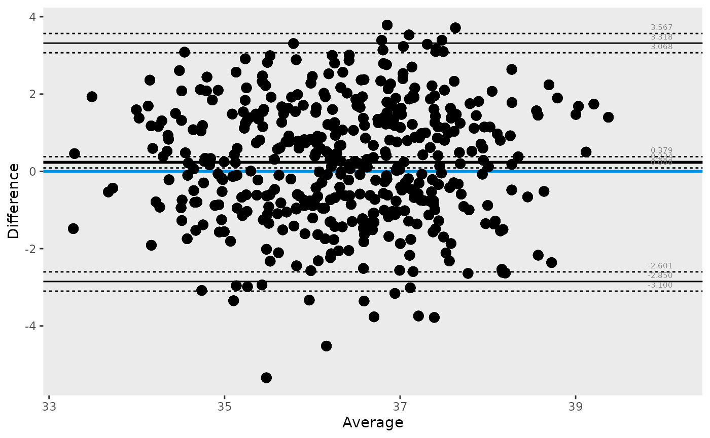
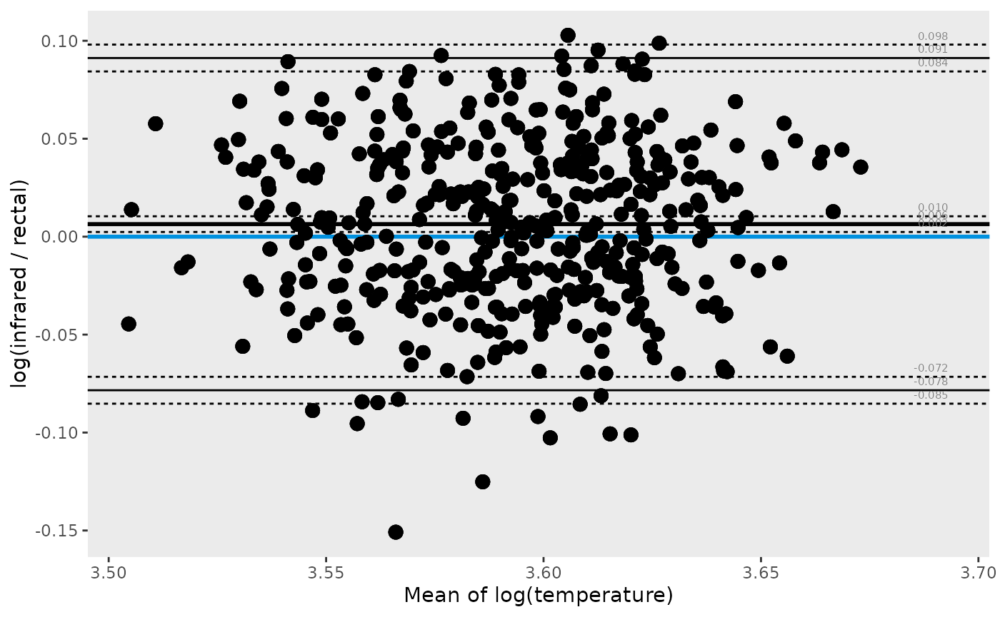
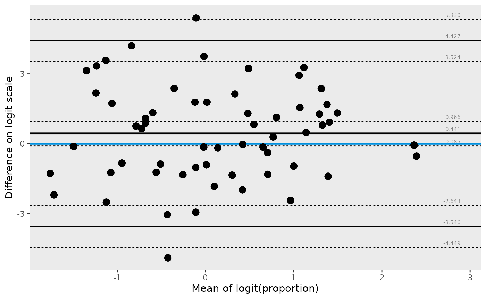

# Compare methods across analysis scales

## Overview

``` r

library(dplyr)
#> 
#> Attaching package: 'dplyr'
#> The following objects are masked from 'package:stats':
#> 
#>     filter, lag
#> The following objects are masked from 'package:base':
#> 
#>     intersect, setdiff, setequal, union
library(knitr)
library(tidyr)
library(ggBA)
```

This vignette compares the same two measurement methods under three
transformations:

1.  `identity`: absolute differences on the original scale
2.  `log`: ratio-focused agreement
3.  `logit`: agreement for proportion-scale measurements

## Prepare paired data

``` r

tbl <- temperature |>
  pivot_wider(names_from = method, values_from = temperature)
```

The `temperature` dataset is stored in long format (`method` +
`temperature` values). For pairwise comparisons, we first create one
column per method (`infrared`, `rectal`).

## Identity scale (default)

Use this when absolute differences are directly interpretable.

``` r

ba_stat(data = tbl, var1 = infrared, var2 = rectal) |>
  pivot_wider(names_from = parameter, values_from = value) |>
  kable(digits = 3)
```

|   n |  bias |  lloa |  uloa | bias.lcl | lloa.lcl | uloa.lcl | bias.ucl | lloa.ucl | uloa.ucl |
|----:|------:|------:|------:|---------:|---------:|---------:|---------:|---------:|---------:|
| 450 | 0.234 | -2.85 | 3.318 |    0.088 |     -3.1 |    3.068 |    0.379 |   -2.601 |    3.567 |

``` r

ba_plot(data = tbl, var1 = infrared, var2 = rectal)
#> Warning: Using `by = character()` to perform a cross join was deprecated in dplyr 1.1.0.
#> ℹ Please use `cross_join()` instead.
#> ℹ The deprecated feature was likely used in the ggBA package.
#>   Please report the issue to the authors.
#> This warning is displayed once per session.
#> Call `lifecycle::last_lifecycle_warnings()` to see where this warning was
#> generated.
```



## Log scale

Use a log transform when proportional differences are more meaningful
than absolute ones. On this scale:

`log(var1) - log(var2) = log(var1 / var2)`

``` r

log_stats <- ba_stat(data = tbl, var1 = infrared, var2 = rectal, transform = "log")

log_stats |>
  pivot_wider(names_from = parameter, values_from = value) |>
  kable(digits = 4)
```

|   n |   bias |    lloa |   uloa | bias.lcl | lloa.lcl | uloa.lcl | bias.ucl | lloa.ucl | uloa.ucl |
|----:|-------:|--------:|-------:|---------:|---------:|---------:|---------:|---------:|---------:|
| 450 | 0.0064 | -0.0784 | 0.0912 |   0.0024 |  -0.0853 |   0.0843 |   0.0104 |  -0.0715 |   0.0981 |

The bias can be back-transformed to a ratio: `exp(bias)` gives the
geometric mean ratio (infrared / rectal).

``` r

log_bias <- log_stats |>
  filter(parameter == "bias") |>
  pull(value)
cat("Geometric mean ratio (infrared / rectal):", round(exp(log_bias), 4), "\n")
#> Geometric mean ratio (infrared / rectal): 1.0064
```

``` r

ba_plot(
  data      = tbl,
  var1      = infrared,
  var2      = rectal,
  transform = "log",
  xlab      = "Mean of log(temperature)",
  ylab      = "log(infrared / rectal)"
)
```



## Logit scale for proportions

For values restricted to `(0, 1)`, a logit transform often gives better
variance behavior and an approximately Normal difference scale.

``` r

set.seed(42)
prop_tbl <- data.frame(
  p1 = runif(60, 0.05, 0.95),
  p2 = runif(60, 0.05, 0.95)
)

logit_stats <- ba_stat(data = prop_tbl, var1 = p1, var2 = p2, transform = "logit")

logit_stats |>
  pivot_wider(names_from = parameter, values_from = value) |>
  kable(digits = 3)
```

|   n |  bias |   lloa |  uloa | bias.lcl | lloa.lcl | uloa.lcl | bias.ucl | lloa.ucl | uloa.ucl |
|----:|------:|-------:|------:|---------:|---------:|---------:|---------:|---------:|---------:|
|  60 | 0.441 | -3.546 | 4.427 |   -0.085 |   -4.449 |    3.524 |    0.966 |   -2.643 |     5.33 |

``` r

ba_plot(
  data      = prop_tbl,
  var1      = p1,
  var2      = p2,
  transform = "logit",
  xlab      = "Mean of logit(proportion)",
  ylab      = "Difference on logit scale"
)
```


