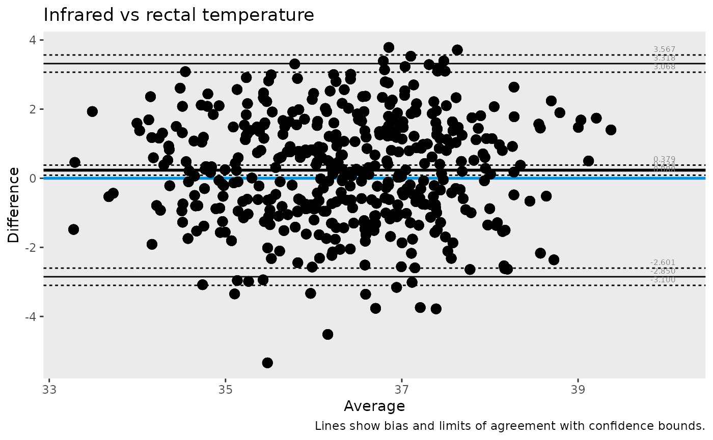

# Getting started with ggBA

## What this guide covers

This short guide walks through a complete Bland-Altman workflow:

1.  reshape long-format data into paired columns
2.  compute agreement statistics
3.  visualize agreement with one line of plotting code

``` r

library(knitr)
library(tidyr)
library(ggBA)
```

## 1) Prepare paired measurements

`temperature` contains one row per animal, visit, and measurement
method.  
To compare two methods directly, pivot to wide format.

``` r

tbl <- temperature |>
  pivot_wider(names_from = method, values_from = temperature)

head(tbl, 6) |>
  kable(digits = 2)
```

| animalID | treatment | visit            | rectal | infrared |
|---------:|:----------|:-----------------|-------:|---------:|
|        1 | healthy   | baseline         |  33.89 |    34.82 |
|        1 | healthy   | visit 1          |  34.57 |    36.49 |
|        1 | healthy   | visit 2          |  35.44 |    36.22 |
|        1 | healthy   | visit 3          |  35.41 |    35.72 |
|        1 | healthy   | end of treatment |  35.68 |    35.06 |
|        2 | vehicle   | baseline         |  37.62 |    38.59 |

## 2) Compute Bland-Altman statistics

``` r

stats_tbl <- ba_stat(tbl, infrared, rectal)
stats_tbl |>
  tidyr::pivot_wider(names_from = parameter, values_from = value) |>
  kable(digits = 3)
```

|   n |  bias |  lloa |  uloa | bias.lcl | lloa.lcl | uloa.lcl | bias.ucl | lloa.ucl | uloa.ucl |
|----:|------:|------:|------:|---------:|---------:|---------:|---------:|---------:|---------:|
| 450 | 0.234 | -2.85 | 3.318 |    0.088 |     -3.1 |    3.068 |    0.379 |   -2.601 |    3.567 |

The most commonly interpreted quantities are:

1.  `bias`: average difference between methods
2.  `lloa` and `uloa`: lower and upper limits of agreement

## 3) Plot agreement

``` r

ba_plot(
  data = tbl,
  var1 = infrared,
  var2 = rectal,
  title = "Infrared vs rectal temperature",
  caption = "Lines show bias and limits of agreement with confidence bounds."
)
#> Warning: Using `by = character()` to perform a cross join was deprecated in dplyr 1.1.0.
#> ℹ Please use `cross_join()` instead.
#> ℹ The deprecated feature was likely used in the ggBA package.
#>   Please report the issue to the authors.
#> This warning is displayed once per session.
#> Call `lifecycle::last_lifecycle_warnings()` to see where this warning was
#> generated.
```



## Next steps

After this baseline workflow, explore:

1.  transformed analyses (`transform = "log"` or `"logit"`)
2.  grouped analyses via `group =` in
    [`ba_stat()`](https://konstantinlang.github.io/ggBA/reference/ba_stat.md)
    and
    [`ba_plot()`](https://konstantinlang.github.io/ggBA/reference/ba_plot.md)
