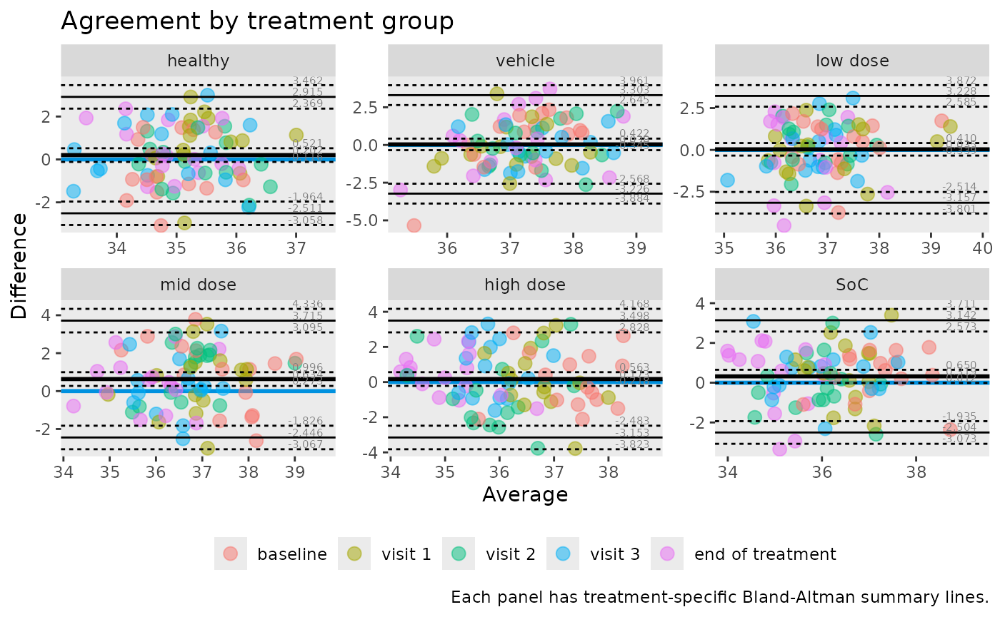

# Grouped and stratified Bland-Altman analysis

## Why group the analysis?

Agreement can differ across biological or operational subgroups.  
`ggBA` supports grouped summaries and faceted plots to inspect those
patterns.

``` r

library(dplyr)
#> 
#> Attaching package: 'dplyr'
#> The following objects are masked from 'package:stats':
#> 
#>     filter, lag
#> The following objects are masked from 'package:base':
#> 
#>     intersect, setdiff, setequal, union
library(knitr)
library(tidyr)
library(ggBA)
```

## Build paired data once

``` r

tbl <- temperature |>
  pivot_wider(names_from = method, values_from = temperature)
```

## Grouped statistics by treatment

``` r

treatment_stats <- ba_stat(
  data = tbl,
  var1 = infrared,
  var2 = rectal,
  group = treatment
)

treatment_stats |>
  filter(parameter %in% c("bias", "lloa", "uloa")) |>
  tidyr::pivot_wider(names_from = parameter, values_from = value) |>
  arrange(treatment) |>
  kable(digits = 3)
```

| treatment |   n |  bias |   lloa |  uloa |
|:----------|----:|------:|-------:|------:|
| healthy   |  75 | 0.202 | -2.511 | 2.915 |
| vehicle   |  75 | 0.038 | -3.226 | 3.303 |
| low dose  |  75 | 0.035 | -3.157 | 3.228 |
| mid dose  |  75 | 0.634 | -2.446 | 3.715 |
| high dose |  75 | 0.173 | -3.153 | 3.498 |
| SoC       |  75 | 0.319 | -2.504 | 3.142 |

This table highlights subgroup-level shifts in bias and spread.

## Faceted Bland-Altman plots

``` r

ba_plot(
  data = tbl,
  var1 = infrared,
  var2 = rectal,
  group = treatment,
  colour = visit,
  title = "Agreement by treatment group",
  caption = "Each panel has treatment-specific Bland-Altman summary lines."
)
```



## Optional: log-scale grouped analysis

If multiplicative differences are more relevant, add
`transform = "log"`:

``` r

ba_stat(
  data = tbl,
  var1 = infrared,
  var2 = rectal,
  group = treatment,
  transform = "log"
) |>
  filter(parameter == "bias") |>
  mutate(geom_ratio = exp(value)) |>
  select(treatment, geom_ratio) |>
  arrange(treatment) |>
  kable(digits = 3)
```

| treatment | geom_ratio |
|:----------|-----------:|
| healthy   |      1.006 |
| vehicle   |      1.001 |
| low dose  |      1.001 |
| mid dose  |      1.017 |
| high dose |      1.005 |
| SoC       |      1.009 |
